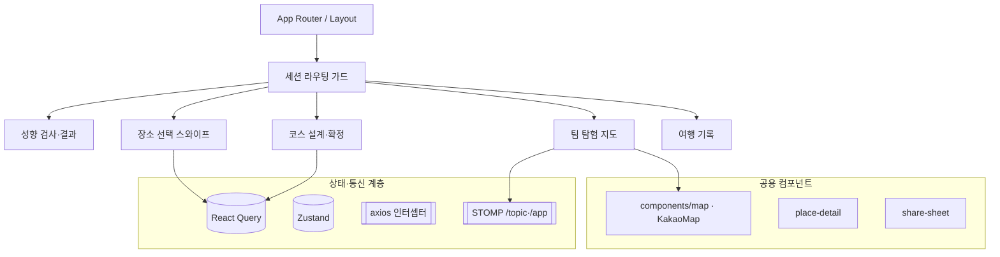
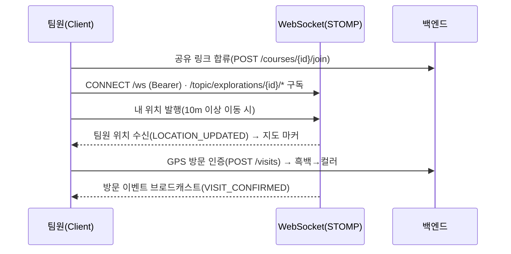
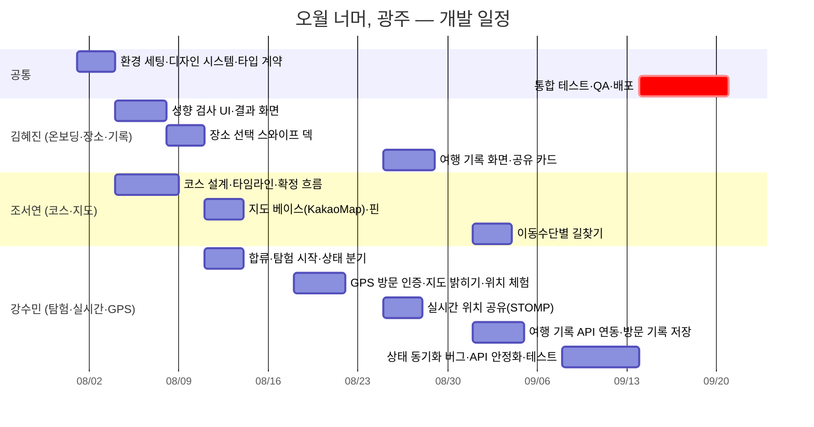

# 🕯️ 오월 너머, 광주 — 5·18 테마 맞춤형 여행 플랫폼

> **성향 검사로 나에게 맞는 광주를 진단하고, 5·18 사적지부터 미식·예술까지 AI가 최적 동선의 코스로 엮어 팀과 함께 '지도를 밝히며' 완성하는 맞춤형 여행 앱**

📍 **배포:** <https://beyond-may.vercel.app/> ・ **인원:** Front-end 3명

---

## 📌 목차

1. [프로젝트 소개](#1-프로젝트-소개)
2. [주요 기능](#2-주요-기능)
3. [기술 스택](#3-기술-스택)
4. [서비스 아키텍처](#4-서비스-아키텍처)
5. [사용자 시나리오](#5-사용자-시나리오-여정-지도)
6. [데이터 활용 (OpenAPI)](#6-데이터-활용-openapi)
7. [개발 일정 (WBS)](#7-개발-일정-wbs)
8. [트러블 슈팅](#8-트러블-슈팅)
9. [담당 역할](#9-담당-역할)
10. [확장 계획](#10-확장-계획)

---

## 1. 프로젝트 소개

**'오월 너머, 광주'** 는 광주의 상징인 **5·18 민주화운동의 역사적 숭고함**을 계승하면서도, 단일 서사에 가려져 있던 도시의 **다층적인 일상(사색·미식·예술·기억)** 을 발견하도록 돕는 **로컬 라이프스타일 여행 큐레이션 서비스**입니다.

> **배경** — 광주는 특정 시기·단일 아이템으로만 회자되어 관광 수요가 한때에 집중되는 경향이 있습니다. 하지만 골목의 카페·오래된 책방, 국립아시아문화전당·광주극장의 예술, 남도의 음식과 디저트까지 도시 곳곳에 매력이 흩어져 있습니다. 이 흩어진 결들을 **하나의 코스로 엮어**, 여행자가 자신의 취향에 맞는 '방문의 명분'을 발견하고 광주를 **사계절 찾고 싶은 여행지**로 만드는 것에서 서비스가 출발했습니다.

사용자의 여행 성향을 **T-MBTI 성향 진단(사색러·미식러·예술러·기억러)** 으로 분석해 개인에게 맞는 장소를 추천하고, **도보 권역·이동 시간을 고려한 최적 동선의 코스**를 AI가 자동 생성합니다. 코스는 **공유 링크로 팀을 초대해 함께 탐험**하며, **실시간 위치 공유**와 **GPS 방문 인증(지도 밝히기 · 수채화 지도 채우기)** 으로 흑백 지도를 하나씩 컬러로 밝히고, 전부 밝히면 축하 모션으로 완주를 기념합니다.

**개발 목적** — ① 5·18 사적지를 성향 추천에 자연스럽게 녹여 젊은 세대가 부담 없이 접하게, ② 성향·기간 기반 초개인화 추천과 AI 코스 자동 설계, ③ 팀 탐험·실시간 공유로 여행을 함께 만드는 기록으로 확장.

---

## 2. 주요 기능

| 분류 | 핵심 기능 | 상세 | 관련 기술 |
| :--- | :--- | :--- | :--- |
| **AI 맞춤 추천** | 성향 검사 → 코스 추천 | T-MBTI 4유형 진단·결과 리포트, 로컬 큐레이션 기반 성향 맞춤 추천 → **도보 권역·이동 시간 고려** AI 코스 자동 생성 | Groq API · 성향 점수 계산 |
| **직관적 선택** | 스와이프 장소 선택 | 카드 스와이프(좋아요/싫어요), 회차별 진행·되돌리기, 기간별 최소·최대 검증 | Framer Motion |
| **AI-사용자 협업** | 코스 설계·수정 | 자연어 재수정, 드래그 순서 변경, 이름·장소 편집 후 확정 | dnd-kit · Groq 챗봇 |
| **팀 동행** | 공유 링크 + 실시간 위치 | 공유 링크 합류(3일), 팀원 실시간 위치 옵트인 공유, **방문 상태 동기화** | **STOMP over WebSocket** |
| **지도 밝히기** | GPS 방문 인증 | 반경 인증 시 흑백→컬러(**수채화 지도 채우기**), 반경 1km 주변 추천, 전부 밝히면 **축하 모션** | Kakao Maps · Geolocation |
| **이동수단 길찾기** | 도보/대중교통/자동차 | 현재 위치→다음 목적지 경로 표시, 지나온 경로선 제거 | 길찾기 API(백엔드 경유) |
| **팀 여행 기록** | 아카이브 | 진행 중/완료 코스, 방문 장소, 밝힌 지도, 사진·메모 보관 | React Query · multipart |

### 🖼️ 화면 미리보기

<p align="center">
  
  
  
  
  
</p>

---

## 3. 기술 스택

| 역할 | 기술 | 선정 이유 |
| :--- | :--- | :--- |
| **Core** | Next.js(App Router) · TypeScript | 파일 기반 라우팅·SSR, 정적 타입으로 팀 간 인터페이스 계약 강제 |
| **AI** | Groq API | 성향별 장소 선별·방문 순서·코스 자동 생성 및 자연어 코스 수정(백엔드 경유) |
| **Styling** | Tailwind CSS (+ `cn()` clsx·tailwind-merge) | 유틸리티 퍼스트, 흑백↔컬러 전환 등 조건부 스타일 |
| **Server State** | React Query | 캐싱·로딩·에러·재시도, QueryKey 팩토리로 무효화 일관화 |
| **Client State** | Zustand | 세션·선택 장소·계정 이력·GPS 등 전역 상태 |
| **HTTP** | axios | 인터셉터로 토큰 자동 첨부 + 공통 래퍼·401 처리 일원화 |
| **Real-time** | **@stomp/stompjs (STOMP)** | 팀 실시간 위치·방문 이벤트 구독/발행 (`/ws`) |
| **Map** | react-kakao-maps-sdk | 코스·탐험·밝힌 지도, 커스텀 오버레이 마커 |
| **Animation/DnD** | Framer Motion · dnd-kit | 스와이프·게이미피케이션, 코스 순서 드래그 |
| **Form** | React Hook Form · Zod | 입력 관리 + 스키마 검증 |
| **Test/Mock** | Vitest · Testing Library · MSW | 유틸 단위 테스트, 백엔드 미확정 구간 병렬 개발 |
| **Quality/Deploy** | ESLint · Prettier · Husky+lint-staged · Vercel | 커밋 전 자동 검사, push 자동 배포 |

> ⚠️ 실시간 통신은 **STOMP(@stomp/stompjs)** 기반 (socket.io 아님).

---

## 4. 서비스 아키텍처

### 4-1. FE 구조도



### 4-2. 데이터 흐름 — 팀 탐험·실시간



---

## 5. 사용자 시나리오 (여정 지도)

### ① 온보딩 — "나에게 맞는 광주를 찾는 첫걸음"

| 단계 | 성향 검사 | 결과 확인 | 세션 시작 |
| :--- | :--- | :--- | :--- |
| **행동** | 7문항 응답 | 유형·추천 장소·공유 카드 확인 | 닉네임·식별코드 등록 |
| **API** | `GET /preference-tests/questions` | `GET /places/recommendations` | `POST /users/sign-up` |
| **감정** | "나는 어떤 여행자일까?" (호기심) | "이 유형 정확하네!" (몰입) | "이제 시작이다" (기대) |

<p align="center">
  
  
  
  
</p>

### ② 코스 설계 — "함께 걸을 길을 만드는 과정"

| 단계 | 기간 설정 | 장소 스와이프 | AI 코스 생성 | 확정·공유 |
| :--- | :--- | :--- | :--- | :--- |
| **행동** | 여행 기간 선택 | 좋아요/싫어요 선택 | AI 자동 코스 확인·수정 | 확정 후 링크 공유 |
| **API** | `POST /recommendations/sets` | `POST /reactions` | `POST /courses/ai-generation` | `POST /courses/{id}/confirm` |
| **감정** | "며칠 다녀올까?" | "여기 가보고 싶다" (설렘) | "동선이 딱 맞네" (만족) | "같이 가자!" (공유) |

<p align="center">
  
  
  
  
</p>

### ③ 팀 탐험 — "역사와 오늘을 함께 걷는 순간"

| 단계 | 팀 합류 | 실시간 이동 | 방문 인증 | 기록 |
| :--- | :--- | :--- | :--- | :--- |
| **행동** | 공유 링크 합류 | 팀원 위치 확인하며 이동 | GPS로 장소 인증 | 사진·메모 남기기 |
| **API** | `POST /courses/{id}/join` | `wss /topic/.../locations` | `POST /visits` | `POST /visits/{id}/record` |
| **감정** | "다 모였다" | "저기 있네" (연결감) | "지도가 밝아진다!" (성취) | "이 순간 남기자" |

<p align="center">
  
  
  
  
</p>

---

## 6. 데이터 활용 (OpenAPI)

장소 데이터는 **한국관광공사 TourAPI**로 광주 지역 관광 정보를 수집·보강한 뒤, 팀 자체 큐레이션(로컬 데이터 65곳)과 합쳐 성향별 추천 후보로 사용합니다. 추천·코스 생성은 **Groq API**, 지도는 **Kakao Maps**로 렌더링합니다. *(데이터 수집·AI 호출은 백엔드가 담당하며, 프론트엔드는 가공된 결과를 소비)*

### 6-1. 한국관광공사 TourAPI

| API | 용도 |
| :--- | :--- |
| `lclsSystmCode2` (관광정보 분류체계 코드 조회) | 카테고리·태그 체계 구성 → 성향별 추천 후보 분류 기준 |
| `areaBasedList2` (지역 기반 관광정보 조회) | 광주 지역 장소 기초 정보 수집·DB 적재 |
| `areaBasedSyncList2` (관광정보 동기화 목록 조회) | 후보 부족·갱신 시 변경분 보충 동기화 |
| `detailCommon2` (공통정보 조회) | 빈 설명·개요 등 기본 정보 보강 |
| `detailIntro2` (소개정보 조회) | 운영·이용 시간 등 상세 소개 보강 |
| `locationBasedList2` (위치 기반 관광정보 조회) | 현재 위치 반경 1km 주변 장소 추천 |

### 6-2. 기타 데이터·API

| 항목 | 활용 |
| :--- | :--- |
| **Groq API** | 성향별 장소 선별, 방문 순서 결정, 코스 자동 생성, 자연어 코스 수정 |
| **Kakao Maps API** | 배경 지도·마커·오버레이 렌더링 |
| **Kakao JS SDK** | 결과·코스 공유 |
| **자체 큐레이션 데이터** | 광주 로컬 장소 65곳 직접 구축 → TourAPI 데이터와 병합 |

> ⚠️ **공유 기능 확인 필요** — 기능 설명서에는 공유를 *Kakao JS SDK(카카오톡 공유)* 로 기재하지만, 현재 프론트 코드는 **Web Share API·클립보드 복사** 기반이야. 실제 구현과 문서 중 어느 쪽으로 통일할지 확인해서 맞춰 줘.

---

## 7. 개발 일정 (WBS)

> 기능 진행 순서 기준 — 실제 날짜는 팀 일정에 맞게 조정



---

## 8. 트러블 슈팅

### 8-1. 코스 확정 시 무한 재시도 루프 (`EXPLORATION409`)

**[문제]** 여러 번 생성·완료하며 테스트하면 "코스 확정하기"에서 계속 "확정하지 못했어요"만 반복.
**[원인]** 이전 테스트의 **활성 탐험이 남아** 새 코스 확정 시 서버가 `EXPLORATION409`("이미 다른 탐험 참여 중")로 차단. 그런데 확정 핸들러에 **`onError`가 없어** 같은 courseId로 재시도 → 같은 409 무한 반복.

```ts
// [Before] onError 없음 → 무한 "다시 시도"
confirmCourse(courseId, { onSuccess: () => { setIsConfirmOpen(false); void refetch(); } });

// [After] 에러 코드별 분기
confirmCourse(courseId, {
  onSuccess: () => { setIsConfirmOpen(false); void refetch(); },
  onError: (error) => {
    const code = getApiCode(error);
    if (code === "EXPLORATION409") {                 // 이미 다른 활성 탐험
      const data = getApiErrorData<DuplicateExplorationErrorData>(error);
      if (data) { setIsConfirmOpen(false); setDuplicateData(data); return; } // 이동/이탈 유도
    }
    if (code === "COURSE409") { setIsConfirmOpen(false); void refetch(); return; } // 이미 확정 → 다음 화면
    if (code === "COURSE404") { router.replace("/places"); return; }              // 없는 코스 → 새로 만들기
  },
});
```

**[해결/교훈]** 서버 에러 코드를 UI 동선으로 매핑(기존 활성 탐험은 join 화면의 중복 참여 상태 컴포넌트를 재사용해 이동/이탈 유도). **"재시도"가 통하지 않는 상태**를 구분하는 것이 UX 회복의 핵심임을 체감.

---

### 8-2. 추천 세트가 옛것으로 고정 (백엔드 재생성 vs 프론트 resume)

**[문제]** 같은 날짜로 다시 장소 선택을 시작하면 이전에 만든 추천 세트(옛 장소/선택)가 그대로 노출. 백엔드는 "같은 날짜여도 재생성"으로 수정했는데도 화면은 동일.
**[원인]** 프론트가 `matchesExisting`이면 `createRecommendationSet`(재생성)를 **호출조차 하지 않고** 기존 세트를 이어받기(resume) → 백엔드 재생성이 반영되지 않음.

```ts
// [After] 이어하기를 "진행 중(미완료 배치가 남은) 세트"로만 한정
const canResume =
  matchesExisting &&
  existingRecommendation.batches.some((batch) => !batch.completed);

if (canResume) { resumeFromRecommendation(existingRecommendation); return; } // 진행 중 → 이어하기
createRecommendationSet({ travelSchedule, startDate, endDate }, { /* ... */ }); // 완료·재시도 → 재생성
```

**[해결/교훈]** "이어하기(UX)"와 "최신 추천(데이터 정합)"이 충돌 → **완료/진행 중 상태로 분기**해 둘 다 확보. 프론트/백엔드 어느 쪽 원인인지 계층을 나눠 진단하는 습관의 중요성.

---

### 8-3. 공유 이미지 CORS / Mixed-content

**[문제]** 결과 공유 "우표 엽서"의 장소 사진이 빈칸(blank), 프로덕션에선 mixed-content 경고.
**[원인]** 캡처(html2canvas)용 `crossOrigin="anonymous"` 때문에 **CORS 미허용 http 이미지(TourAPI)** 가 로드 실패. 프로덕션(https)에선 http 이미지가 mixed-content로 차단.

```ts
// app/api/image-proxy/route.ts — 외부 이미지를 같은 출처·https·CORS로 우회
const ALLOWED_HOST_SUFFIXES = ["visitkorea.or.kr"]; // SSRF 방지 allowlist
export const GET = async (request: NextRequest): Promise<Response> => {
  const url = request.nextUrl.searchParams.get("url");
  const target = new URL(url!);
  if (!ALLOWED_HOST_SUFFIXES.some((h) => target.hostname.endsWith(h)))
    return new Response("Forbidden", { status: 403 });
  const upstream = await fetch(target.toString());
  return new Response(upstream.body, {
    headers: {
      "Content-Type": upstream.headers.get("content-type") ?? "image/jpeg",
      "Access-Control-Allow-Origin": "*",
      "Cache-Control": "public, max-age=86400",
    },
  });
};
// 사용처: <StampPhoto src={toProxiedImage(place.placeImg)} />
```

**[해결/교훈]** 서버(Route Handler)가 http 이미지를 대신 받아 **https + CORS**로 재서빙 → 표시·캡처·프로덕션 렌더를 한 번에 해결. `dangerouslySetInnerHTML` 대신 프록시로 **XSS 없이** 외부 자원을 안전하게 소비.

---

### 8-4. 팀원 실시간 위치가 지도에 안 뜸

**[문제]** 위치 발행은 되는데 팀원 위치가 지도에 표시되지 않음.
**[원인]** 소켓 수신 핸들러 `onLocation`이 **`console.log` 스텁**으로 남아 있어, 받은 위치를 렌더로 연결하지 않음(수신→렌더 미구현).

```ts
// [After] 수신 위치를 participantId별 상태로 누적 (본인 제외)
onLocation: (payload) => {
  const loc = payload.data;
  if (loc.participantId === myParticipantIdRef.current) return; // 내 위치는 myLocation으로 표시
  setTeammates((prev) => new Map(prev).set(loc.participantId, loc));
},
// VisitMap: member 마커로 변환 (KakaoMap의 variant:"member" 렌더 재사용)
const memberMarkers: MapMarker[] = (teammates ?? []).map((t) => ({
  id: `member-${t.participantId}`,
  position: { lat: t.latitude, lng: t.longitude },
  variant: "member",
  label: t.displayName,
}));
```

**[해결/교훈]** 렌더 계층(KakaoMap member 마커)·소켓 타입은 이미 준비돼 있었고, **"수신→상태→렌더" 연결만** 빠져 있었음. 실시간 기능은 발행/수신/렌더를 분리해 어느 단계가 끊겼는지 추적하는 것이 관건.

---

### 8-5. 시작 전 member에게 '체험 시작' 배너 노출

**[문제]** 탐험을 시작(ONGOING)하지 않았는데도 합류한 member에게 "광주에서 체험 시작" 배너가 뜸.
**[원인]** 배너 노출 조건에 **탐험 상태(ONGOING) 체크가 누락** — 광주 밖/권한 거부만 보고 표시.

```ts
const showSimulationBanner =
  isOngoing &&                                   // 진행 중일 때만 (추가)
  !isSimulationEnabled &&
  (isOutOfGwangju || geoPermission === "denied");
```

**[해결/교훈]** 상태(BEFORE/ONGOING/COMPLETED)에 따라 노출/동작을 게이팅해야 하는 UI를 상태 조건으로 명시. 권한(canCompleteEarly 등) 게이팅도 같은 원칙으로 정리.

---

## 9. 담당 역할

| 담당 | 영역 |
| :--- | :--- |
| **김혜진** | 디자인(리드) + `features/onboarding · places · record` + 공용 컴포넌트 |
| **조서연** | 디자인 + `features/course` + `components/map`(지도 베이스) · 이동수단 길찾기 |
| **강수민 (팀 리드/실시간·탐험)** | `features/explore` + 실시간(STOMP)·GPS + 앱 전반 API 연동·안정화 |

### 🎨 김혜진 — 상세 기여 (디자인 리드 · 온보딩 · 장소 · 기록)

**[ 디자인 시스템 · 공용 컴포넌트 ]**
- **디자인 토큰 정의** — `globals.css`에 유형별 테마색(사색러=보라/미식러=주황/예술러=초록/기억러=파랑), primary·neutral 팔레트, 그림자·모서리 반경, 지도 핀 색을 CSS 변수로 공통화
- **공용 컴포넌트 구축** — `Button` · `Modal` · `AppHeader` · `Sidebar` · `ShareSheet` · `GradientBackground` 및 아이콘 세트, `cn()`(clsx·tailwind-merge) 기반 조건부 스타일
- **모바일 프레임 반응형** — `max-w-[430px]` 기준 앱 프레임, safe-area 대응

**[ 온보딩 · 성향 검사 ]**
- **성향 검사 화면** — 문항 풀에서 7문항 랜덤 선별, scroll-snap 진행·이전 답 수정(`useQuiz`), 진행률 바
- **결과 화면** — 유형 카드·4유형 비율, 결과 계산 로딩 애니메이션
- **결과 공유 카드 2종** — 결과 카드형 + 우표 엽서형(`StampPhoto` 사방 톱니 SVG 콜라주), 이미지 캡처·다운로드·Web Share(`useCaptureImage`)
- **닉네임 등록·식별코드 모달** — 비로그인 성향 결과를 세션으로 전환

**[ 장소 선택 · 여행 기록 ]**
- **스와이프 카드덱** — Framer Motion 드래그 제스처, 겹친 카드 스택·되돌리기, 좋아요/싫어요 확정
- **여행 기간 선택** — 기간별 최소/최대 장소 수 검증(`travelSchedule`), 선택 목록 모달
- **여행 기록 화면** — 진행 중/완료/방문한 장소 탭 UI, 기록 상세·공유 카드

---

### 🗺️ 조서연 — 상세 기여 (코스 설계 · 지도 · 길찾기)

**[ 코스 설계 · 수정 ]**
- **AI 코스 흐름** — 코스 생성 로딩·결과, 일차 통합 순번의 코스 타임라인
- **직접 수정** — dnd-kit 기반 순서 드래그·삭제·되돌리기, 폴리라인·타임라인 즉시 재렌더, 기간별 최소 장소 수 검증
- **AI 수정** — 챗봇 미리보기/적용, 수정 횟수 소진 시 안내 모달, 추천 장소 추가 후 NEW 배지(`?added=` 연동)
- **확정 흐름** — draft→confirmed 확정 및 재확인 다이얼로그, **확정 후 하단 시트(`CourseBottomSheet`)**, 공유 링크·기간별 최대 장소 수 제한

**[ 지도 (공용 map) ]**
- **KakaoMap 베이스** — 커스텀 오버레이 마커·핀 규칙(다음 목적지=깃발 / 남은 순서=물방울 번호 / 방문 완료=체크·glow), 마커 클러스터링
- **탐험 지도 하단 시트** — 다음 목적지·진행률·주변 추천·코스 보기, 지도 버튼 상시 노출

**[ 이동수단 길찾기 ]**
- **길찾기 연동(백엔드 `/routes` 경유)** — 도보/대중교통/자동차 경로, 현재 위치→다음 목적지 경로선 렌더, 지나온 만큼 경로선 제거·방문 시 자동 제거

---

### 🧑‍💻 강수민 — 상세 기여

**[ 실시간·탐험 (주 담당) ]**
- **STOMP 기반 실시간 팀 위치 공유** — 소켓 위치 이벤트 수신 → participantId별 상태 누적(본인 제외·공유 해제 반영) → 지도에 팀원 마커 렌더링
- **GPS 방문 인증·지도 밝히기** 연동, **광주 외 지역 판정**, 광주 밖/권한 거부 시 진입 배너 처리
- **위치 체험(시뮬레이션) 모드** — 실제 GPS 대신 코스를 자동 순회하며 방문 인증(심사·데모용), 진입 조건(ONGOING) 게이팅
- **탐험 합류·시작·이탈 흐름** 및 탐험 상태 기반 UI 분기(완료 버튼 권한 `canCompleteEarly` 게이팅 등)

**[ 여행 기록·온보딩 ]**
- **여행 기록 허브** 실 API 연동 — 진행 중/완료/방문한 장소 3탭, 회차 기준 방문·"밝힌 지도"(유형별 색)
- **방문 기록 저장** — 사진(최대 3장)·메모 저장 페이지 (multipart FormData)
- **신규 사용자 온보딩 분기** — 세션 만료와 무관하게 유지되는 **계정 이력 스토어** 설계로 신규/기존 사용자 사이드바 분기

**[ 상태 동기화·안정화 (앱 전반) ]**
- 코스 확정 `EXPLORATION409`/`COURSE404` 처리(재시도 루프 제거)
- 추천 세트 재생성 로직(완료/진행 중 구분)
- 탐험 완료 후 여행 기록 진입 시 목록 캐시 갱신, 코스 이름 저장 연동
- 성향 재검사 결과 저장 연동

**[ 인프라·품질 ]**
- **이미지 CORS·mixed-content 해결** — Next Route Handler 이미지 프록시 구현
- **Vitest 테스트 환경 구축** — `@/` 경로 별칭 해석, 성향 계산·여행 일정 유틸 단위 테스트
- **axios 인터셉터**(토큰 자동 첨부·공통 래퍼·401 처리) 기반 API 계층
- **FE/BE 협업** — Postman 스펙 기반 API 계약 정합, 프론트/백엔드 원인 분리 진단 후 백엔드 개선 요청(추천 세트 재생성·성향 재검사 저장·활성 탐험 정리 등)
- **배포·품질** — Vercel 프리뷰 CORS/도메인 이슈 진단, Lighthouse 성능 분석으로 개선점(이미지 최적화) 도출

---

## 10. 확장 계획

- **AR 과거 모습 복원** — 사적지에서 카메라로 당시 모습 오버레이
- **다국어 확장** — 영/중/일 성향 검사·장소 설명
- **소상공인 연계 쿠폰** — 코스 완주 시 인근 상점 할인
- **팀 기록 고도화** — 완주·밝힌 지도 기반 팀 뱃지·랭킹
